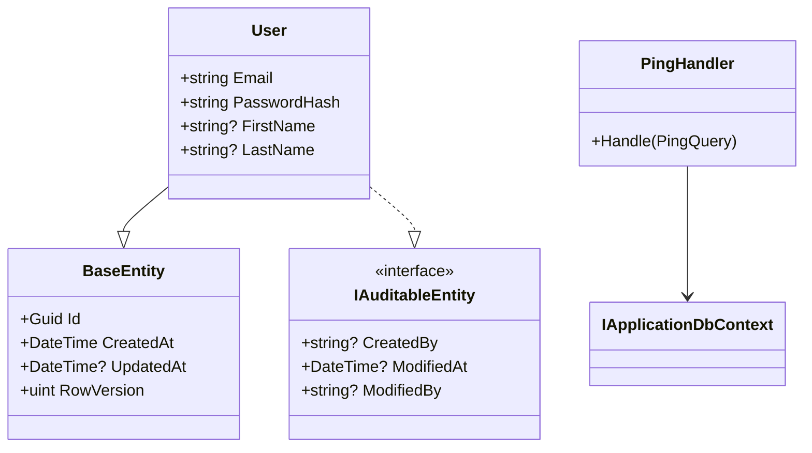

# `/create-code-diagram`

Generate a comprehensive Mermaid class diagram of the entire project codebase. Shows every class, interface, entity, handler, service — and how they relate to each other (inheritance, implementation, dependency, composition).

This is for **humans** — when you want to see the full picture, understand the system, or debug your mental model of the architecture.

Ships as a global skill in [core](https://github.com/agentteamland/core).

## Usage

```
/create-code-diagram                       # writes .claude/docs/code-diagram.md
/create-code-diagram path/to/output.md     # writes to the path you specify
```

Re-runnable. Each run overwrites the previous diagram. Always fresh.

## What gets discovered

| Discovered | How |
|---|---|
| Classes, records, interfaces, enums, abstract classes | Codebase scan via `codebase-memory-mcp` if available, otherwise direct file scanning |
| Inheritance | `class extends base` |
| Interface implementations | `class implements interface` |
| Dependencies | Constructor injection, method parameters |
| Composition | Class has property of another class type |
| Mediator handlers | Which command/query each handler covers |

## What gets organized

Discovered types are grouped by architectural layer:

```mermaid
%% Domain Layer
%% Application Layer — Interfaces
%% Application Layer — Features
%% Infrastructure Layer
%% API Layer — Endpoints
```

For each layer, the skill lists every type with its key members — properties for entities, methods for services and handlers.

## Relationship arrows

| Relationship | Mermaid syntax | When |
|---|---|---|
| Inheritance | `Child --|> Parent` | class extends base class |
| Implementation | `Impl ..\|> Interface` | class implements interface |
| Dependency | `ClassA --> ClassB` | constructor injection, method call |
| Composition | `ClassA *-- ClassB` | has property of type ClassB |
| Association | `ClassA o-- ClassB` | collection of ClassB |

## Output format

Default location: `.claude/docs/code-diagram.md`

```markdown
# Code Diagram

> Auto-generated by /create-code-diagram on {date}
> Re-run `/create-code-diagram` to update after code changes.

## Full Project Diagram

{mermaid classDiagram block}

## Legend
{relationship-arrow table}

## Statistics
- Total types: {count}
- Classes: {count}
- Interfaces: {count}
- Records: {count}
- Relationships: {count}
- Generated: {timestamp}
```

The output is pure Mermaid markdown — viewable in GitHub, VS Code Mermaid preview, or any markdown renderer that supports Mermaid (no external tools needed).

## Sample diagram fragment



## Important rules

1. **Include EVERYTHING.** Don't skip small classes or "obvious" relationships. The user wants the full picture.
2. **Group by layer.** Domain → Application Interfaces → Application Features → Infrastructure → API/Socket/Worker.
3. **Show key members.** Properties for entities, methods for services and handlers. Don't list every private field.
4. **Correct arrow types.** Inheritance vs implementation vs dependency — use the right Mermaid syntax.
5. **Re-runnable.** Running again overwrites the previous diagram.
6. **No external tools.** Pure Mermaid markdown.

## Related

- [Concepts: Skill](/guide/concepts#skill) — where this fits in the skill ecosystem

## Source

- Spec: [core/skills/create-code-diagram/skill.md](https://github.com/agentteamland/core/blob/main/skills/create-code-diagram/skill.md)
