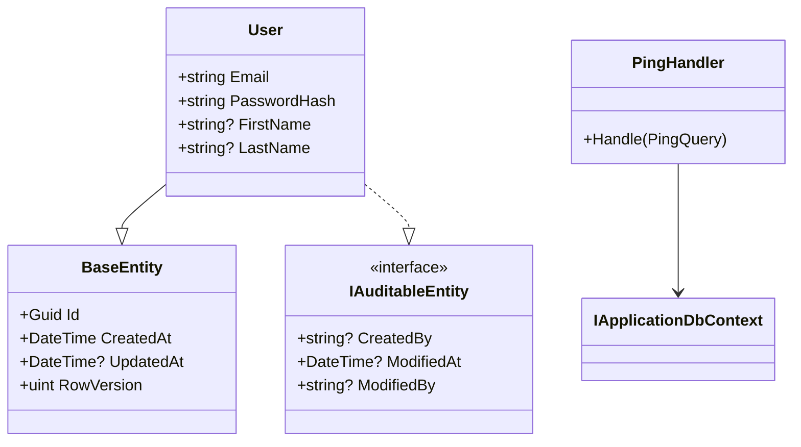

# `/create-code-diagram`

Tüm proje kod tabanının kapsamlı bir Mermaid sınıf çizimini üretir. Her sınıfı, arabirimi, varlığı, handler'ı ve servisi — bunların birbiriyle nasıl ilişkili olduğunu (kalıtım, uygulama, bağımlılık, kompozisyon) gösterir.

Bu çıktı **insanlar içindir** — tüm resmi görmek, sistemi anlamak ya da mimariye dair zihinsel modelini ayıklamak istediğinde.

Global beceri olarak [core](https://github.com/agentteamland/core) içinde yayımlanır.

## Kullanım

```
/create-code-diagram                       # .atl/docs/code-diagram.md dosyasına yazar
/create-code-diagram path/to/output.md     # belirttiğin yola yazar
```

Yeniden çalıştırılabilir. Her çalıştırma önceki çizimin üzerine yazar. Daima taze.

## Ne keşfedilir?

| Keşfedilen | Nasıl |
|---|---|
| Sınıflar, kayıtlar, arabirimler, sayımlar, soyut sınıflar | `codebase-memory-mcp` varsa onunla, yoksa doğrudan dosya tarayarak. |
| Kalıtım | `class extends base`. |
| Arabirim uygulaması | `class implements interface`. |
| Bağımlılıklar | Yapıcı enjeksiyonu, yöntem parametreleri. |
| Kompozisyon | Sınıfın başka bir sınıf türünde özelliği vardır. |
| Mediator handler'ları | Hangi handler hangi komut/sorguyu karşılar. |

## Ne düzenlenir?

Keşfedilen türler mimari katmana göre gruplanır:

```mermaid
%% Domain Layer
%% Application Layer — Interfaces
%% Application Layer — Features
%% Infrastructure Layer
%% API Layer — Endpoints
```

Her katman için beceri, tür başına anahtar üyeleri listeler — varlıklar için özellikler, servisler ve handler'lar için yöntemler.

## İlişki okları

| İlişki | Mermaid sözdizimi | Ne zaman |
|---|---|---|
| Kalıtım | `Child --|> Parent` | Sınıf temel sınıfı genişletiyor. |
| Uygulama | `Impl ..\|> Interface` | Sınıf arabirimi uyguluyor. |
| Bağımlılık | `ClassA --> ClassB` | Yapıcı enjeksiyonu, yöntem çağrısı. |
| Kompozisyon | `ClassA *-- ClassB` | `ClassB` türünde bir özellik içeriyor. |
| İlişkilendirme | `ClassA o-- ClassB` | `ClassB` koleksiyonu içeriyor. |

## Çıktı biçimi

Varsayılan konum: `.atl/docs/code-diagram.md`.

```markdown
# Code Diagram

> Auto-generated by /create-code-diagram on {date}
> Re-run `/create-code-diagram` to update after code changes.

## Full Project Diagram

{mermaid classDiagram block}

## Legend
{ilişki-okları tablosu}

## Statistics
- Total types: {count}
- Classes: {count}
- Interfaces: {count}
- Records: {count}
- Relationships: {count}
- Generated: {timestamp}
```

Çıktı saf Mermaid Markdown'dur — GitHub'da, VS Code'un Mermaid önizlemesinde ya da Mermaid'i destekleyen herhangi bir Markdown görüntüleyicide görünür (dış araç gerekmez).

## Örnek çizim parçası



## Önemli kurallar

1. **HER ŞEYİ dahil et.** Küçük sınıfları ya da "apaçık" ilişkileri atlama. Kullanıcı tüm resmi istiyor.
2. **Katmana göre gruplan.** Domain → Application Interfaces → Application Features → Infrastructure → API/Socket/Worker.
3. **Anahtar üyeleri göster.** Varlıklar için özellikler, servisler ve handler'lar için yöntemler. Her özel alanı listeleme.
4. **Doğru ok türleri.** Kalıtım vs uygulama vs bağımlılık — doğru Mermaid sözdizimini kullan.
5. **Yeniden çalıştırılabilir.** Yeniden çalıştırmak önceki çizimin üzerine yazar.
6. **Dış araç yok.** Saf Mermaid Markdown.

## İlgili

- [Kavramlar: Beceri](/tr/guide/concepts#skill) — bu becerinin beceri ekosisteminde nereye oturduğu.

## Kaynak

- Belirtim: [core/skills/create-code-diagram/skill.md](https://github.com/agentteamland/core/blob/main/skills/create-code-diagram/skill.md).
