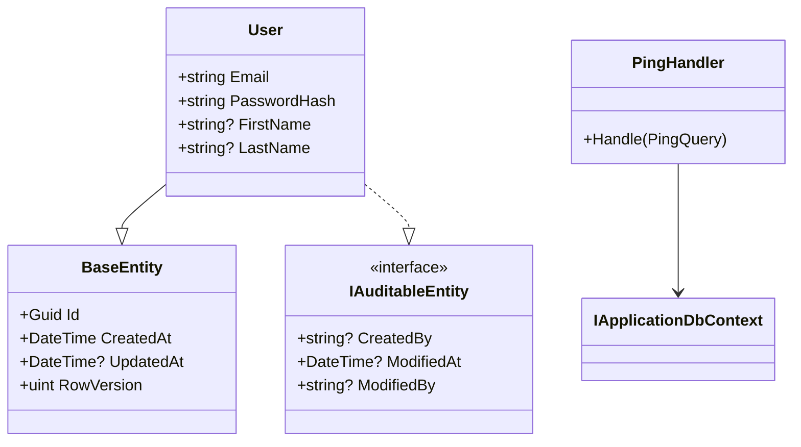

# `/create-code-diagram`

Tüm proje kod tabanının kapsamlı bir Mermaid class diagram'ını üretir. Her sınıfı, interface'i, entity'yi, handler'ı, service'i — ve birbirleriyle nasıl ilişkili olduklarını (inheritance, implementation, dependency, composition) gösterir.

Bu **insanlar için** — tüm resmi görmek, sistemi anlamak veya mimarinin zihinsel modelini debug etmek istediğinde.

Global skill olarak [core](https://github.com/agentteamland/core)'da gelir.

## Kullanım

```
/create-code-diagram                       # .claude/docs/code-diagram.md yazar
/create-code-diagram path/to/output.md     # belirttiğin path'e yazar
```

Re-runnable. Her çalıştırma önceki diagram'ın üzerine yazar. Daima taze.

## Ne keşfedilir

| Keşfedilen | Nasıl |
|---|---|
| Sınıflar, record'lar, interface'ler, enum'lar, abstract sınıflar | `codebase-memory-mcp` varsa onunla, yoksa direkt file scanning |
| Inheritance | `class extends base` |
| Interface implementation | `class implements interface` |
| Dependency'ler | Constructor injection, method parameter'ları |
| Composition | Sınıf başka bir sınıf tipinde property'ye sahip |
| Mediator handler'lar | Hangi handler hangi command/query'yi karşılar |

## Ne organize edilir

Keşfedilen tipler mimari katmana göre gruplanır:

```mermaid
%% Domain Layer
%% Application Layer — Interfaces
%% Application Layer — Features
%% Infrastructure Layer
%% API Layer — Endpoints
```

Her katman için skill her tipi key member'larıyla listeler — entity'ler için property'ler, service ve handler'lar için method'lar.

## İlişki ok'ları

| İlişki | Mermaid syntax | Ne zaman |
|---|---|---|
| Inheritance | `Child --|> Parent` | class extends base class |
| Implementation | `Impl ..\|> Interface` | class implements interface |
| Dependency | `ClassA --> ClassB` | constructor injection, method call |
| Composition | `ClassA *-- ClassB` | type ClassB property var |
| Association | `ClassA o-- ClassB` | ClassB collection'ı var |

## Çıktı formatı

Default location: `.claude/docs/code-diagram.md`

```markdown
# Code Diagram

> Auto-generated by /create-code-diagram on {date}
> Re-run `/create-code-diagram` to update after code changes.

## Full Project Diagram

{mermaid classDiagram block}

## Legend
{relationship-arrow tablosu}

## Statistics
- Total types: {count}
- Classes: {count}
- Interfaces: {count}
- Records: {count}
- Relationships: {count}
- Generated: {timestamp}
```

Çıktı saf Mermaid markdown — GitHub'da, VS Code Mermaid preview'da veya Mermaid destekli herhangi bir markdown renderer'da görüntülenebilir (harici tool gerekmez).

## Örnek diagram parçası



## Önemli kurallar

1. **HER ŞEYİ dahil et.** Küçük sınıfları veya "obvious" ilişkileri atlama. Kullanıcı tüm resmi istiyor.
2. **Katmana göre gruplan.** Domain → Application Interfaces → Application Features → Infrastructure → API/Socket/Worker.
3. **Key member'ları göster.** Entity'ler için property'ler, service ve handler'lar için method'lar. Her private field'ı listeleme.
4. **Doğru ok tipleri.** Inheritance vs implementation vs dependency — doğru Mermaid syntax'ını kullan.
5. **Re-runnable.** Tekrar çalıştırma önceki diagram'ın üzerine yazar.
6. **Harici tool yok.** Saf Mermaid markdown.

## İlgili

- [Kavramlar: Skill](/tr/guide/concepts#skill) — bu skill ekosistemde nereye oturur

## Kaynak

- Spec: [core/skills/create-code-diagram/skill.md](https://github.com/agentteamland/core/blob/main/skills/create-code-diagram/skill.md)
